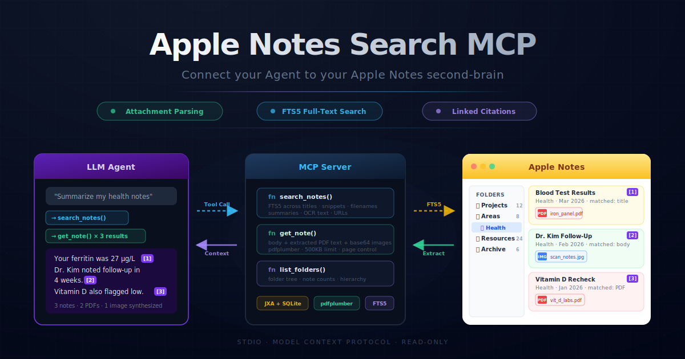

# apple-notes-pdf-mcp

<p align="center">
  
</p>

An MCP server that gives LLMs access to your Apple Notes -- including extracted text from PDF attachments and inline images.

Every existing Apple Notes integration only exposes note body text via AppleScript. This server goes further: it queries the NoteStore SQLite database to find PDF and image attachments, resolves their on-disk file paths, extracts text with [pdfplumber](https://github.com/jsvine/pdfplumber), encodes images for multimodal LLMs, and provides FTS5 full-text search across titles, snippets, filenames, summaries, OCR text, and URLs. An LLM can search and reason over receipts, lab results, contracts, papers -- anything you've attached to a note.

## Why this exists

AppleScript can tell you a PDF is attached to a note, but it can't read what the PDF says or show you an image. This server bridges that gap by combining two access paths:

1. **AppleScript (JXA)** for note body text, titles, and metadata
2. **SQLite + filesystem** for resolving attachment file paths, extracting PDF content, encoding images, and FTS5 full-text search

The search is FTS5-backed with Porter stemming, meaning it finds notes by **title, body snippet, attachment filename, summary, OCR summary, and URL** -- not just body text. A note titled "Followup appointment" with a PDF named "blood test results.pdf" will be found when you search for "blood test." Every result includes a `citation` field with a pre-formatted markdown link that opens the note directly in Notes.app (works on macOS and iOS, including in Telegram).

## Install

### Claude Desktop

Add to `~/Library/Application Support/Claude/claude_desktop_config.json`:

```json
{
  "mcpServers": {
    "apple-notes-pdf": {
      "command": "uvx",
      "args": ["apple-notes-pdf-mcp"]
    }
  }
}
```

### Claude Code

```bash
claude mcp add apple-notes-pdf -- uvx apple-notes-pdf-mcp
```

### Other MCP clients

```bash
uvx apple-notes-pdf-mcp
```

The server communicates over stdio using the [Model Context Protocol](https://modelcontextprotocol.io/).

## Tools

| Tool | Description |
|------|-------------|
| `search_notes` | The primary discovery tool. With a query: FTS5 full-text search across titles, snippets, filenames, summaries, OCR text, and URLs. With an empty query: lists recent notes (like "list all"). Supports `folder`, `sort_by`, `limit` (default 50), and `ascending` params. |
| `get_note` | Get a note's full body text + extracted PDF text + base64-encoded images in one call. Supports `max_pages_per_pdf` (default 50), `include_images` (default True), `max_image_size` (default 1MB), and a 500KB total text limit. |
| `list_folders` | List all folders as a tree with note counts per folder. Use to understand folder hierarchy before searching. |

## Example

```
User: What was my ferritin level in my latest blood test?

Claude: I'll search your notes for blood test results.
-> search_notes("ferritin")
   Found "Followup Blood Test" (matched via fts5)
   citation: "[Followup Blood Test](https://...apple-notes-pdf-mcp/?id=ABC123)"

-> get_note("x-coredata://.../ICNote/p11734")
   Extracted text from "iron ferritin blood test results.pdf"

Your ferritin level was 27 ug/L according to the iron studies panel
in your attached PDF.
Source: [Followup Blood Test](https://...apple-notes-pdf-mcp/?id=ABC123)
```

The `citation` field in every response is a pre-formatted markdown link. Agents should copy it verbatim. The link redirects through a lightweight page that detects iOS vs macOS and opens Notes.app with the correct URI scheme.

### Multiple sources

When a query spans multiple notes, each result has its own `citation`:

```
User: Give me a timeline of my iron deficiency.

Claude:
-> search_notes("iron")  -- returns 3 notes, each with citation field

Dec 2025: Ferritin 50.3 ug/L (normal range)
[annual blood test results](https://...apple-notes-pdf-mcp/?id=A9B5...)

Feb 2026: Ferritin 27 ug/L (below range, iron deficient)
[Followup Blood Test](https://...apple-notes-pdf-mcp/?id=5391...)

Ongoing: Supplementing with iron bisglycinate, red meat 2x/week
[Iron deficiency plan](https://...apple-notes-pdf-mcp/?id=9D8C...)
```

## Agent Configuration

See [USAGE.md](USAGE.md) for a detailed guide on configuring LLM agents, including:

- Recommended navigation workflow (list folders -> search -> get note)
- Folder-scoped system prompt templates
- Citation patterns with clickable deep links (HTTPS redirect → Notes.app)
- FTS5 search tips (stemming, prefix matching)
- Full tool parameter reference

## Requirements

- **macOS 12+** (Monterey or later)
- **Python 3.10+** (installed automatically via `uv`)
- **Full Disk Access** for your terminal app

### Granting Full Disk Access

System Settings -> Privacy & Security -> Full Disk Access -> add Terminal / iTerm / Claude Desktop.

This is required because `NoteStore.sqlite` and the `Media/` directory live in a protected location (`~/Library/Group Containers/group.com.apple.notes/`). Without it, SQLite queries and PDF file reads will fail with permission errors.

### Automation permission

The first time the server runs, macOS will prompt you to allow your terminal to control Notes.app. Click **Allow**. This is needed for the AppleScript/JXA calls that read note body text.

## How it works

```
+-------------------------------------------+
|  MCP Client (Claude Desktop / Code)       |
+-------------------+-----------------------+
                    | MCP protocol (stdio)
+-------------------v-----------------------+
|  apple-notes-pdf-mcp                      |
|                                           |
|  Tools:                                   |
|  +- search_notes         (FTS5 / SQLite)  |
|  +- get_note             (JXA + SQLite)   |
|  +- list_folders         (SQLite)         |
|                                           |
|  Internal modules:                        |
|  +- applescript.py   -> JXA wrappers      |
|  +- notestore.py     -> SQLite + FTS5     |
|  +- pdf_extract.py   -> pdfplumber        |
|  +- image_extract.py -> sips + base64     |
+--------+------------------+--------------+
         |                  |
         v                  v
   Notes.app          NoteStore.sqlite
   (JXA)              + Media/ files
                      + FTS5 index (temp)
```

### Key design decisions

- **Read-only.** The server never writes to the database, media files, or notes. All AppleScript calls are read operations. SQLite opens in read-only mode (FTS5 index is built on a temp copy).
- **FTS5 full-text search.** A virtual FTS5 table with Porter stemming is created on the temp DB copy at search time. It indexes titles, snippets, attachment filenames, summaries, OCR summaries, and URLs -- giving ranked, typo-tolerant results.
- **Image support via sips.** HEIC images are converted to JPEG using macOS's built-in `sips` tool. Images over the size limit are resized down. Encoded as base64 and returned as MCP `ImageContent` blocks.
- **Deep links via ZIDENTIFIER.** Every response includes a `citation` field with a clickable HTTPS link that redirects to `notes://` (macOS) or `mobilenotes://` (iOS) via a lightweight GitHub Pages redirect. Platform detection is automatic.
- **WAL-safe DB access.** The NoteStore database is copied (with WAL and SHM files) to a temp directory before querying, avoiding lock contention with Notes.app.
- **ZACCOUNT column probing.** The column used for note->account joins varies across macOS versions (`ZACCOUNT2` through `ZACCOUNT8`). The server probes for the correct one at startup.
- **Intermediate subdirectory handling.** On-disk attachment paths include a variable intermediate directory (`Media/{uuid}/{sub_uuid}/{filename}`), resolved via glob.

## Error handling

| Scenario | Behavior |
|----------|----------|
| PDF not downloaded from iCloud | `"error": "not_downloaded"` for that attachment; others still extracted |
| Scanned/image-only PDF | `"error": "no_extractable_text"` -- OCR is not supported in this version |
| Password-protected PDF | `"error": "encrypted_pdf"` |
| Image not downloaded from iCloud | `"error": "not_downloaded"` for that image |
| Unsupported image format | `"error": "unsupported_format_{ext}"` |
| Notes.app not running | AppleScript auto-launches it (standard macOS behavior) |
| SQLite locked | DB is copied to temp dir first, so this shouldn't occur |
| Total text exceeds 500KB | Text is truncated with `"error": "truncated_size_limit"` |

## Development

```bash
git clone https://github.com/james-andrews-coulter/apple-notes-pdf-mcp.git
cd apple-notes-pdf-mcp
uv sync
uv run pytest tests/ -v
```

### Project structure

```
src/apple_notes_pdf_mcp/
+-- server.py          # MCP server, tool definitions
+-- applescript.py     # JXA wrappers for Notes.app
+-- notestore.py       # SQLite queries + FTS5 against NoteStore.sqlite
+-- pdf_extract.py     # pdfplumber text extraction
+-- image_extract.py   # sips conversion + base64 encoding
tests/
+-- test_applescript.py    # Mocked JXA tests
+-- test_notestore.py      # SQLite fixture tests
+-- test_pdf_extract.py    # PDF extraction tests
+-- test_image_extract.py  # Image encoding tests
```

## Limitations

These are explicitly out of scope for v0.2:

- **OCR for scanned PDFs** -- would require Tesseract or similar
- **Video/audio attachments** -- not supported
- **Write operations** -- no creating, editing, or deleting notes
- **Rich text / HTML** -- body is returned as plaintext only
- **Cross-platform** -- macOS only (Apple Notes on iOS/iPadOS is not addressable via MCP)

## License

MIT
